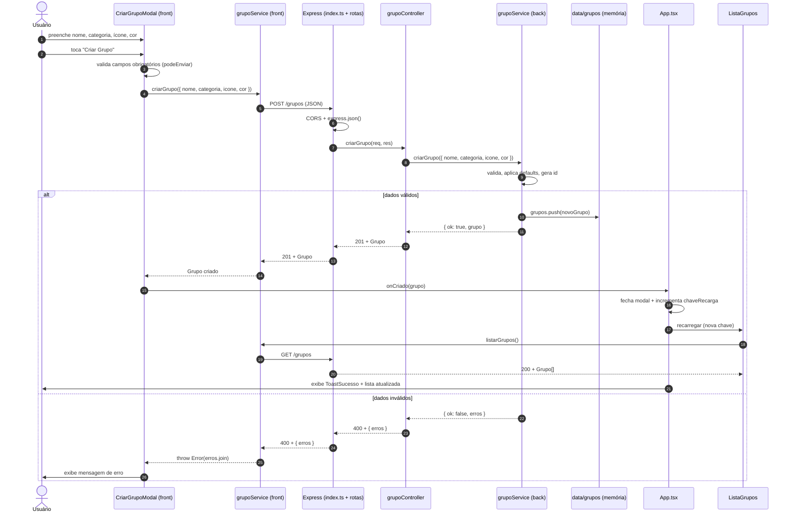

# 4.2. Módulo Reutilização de Software

SEGUNDA OPÇÃO DE ENTREGA: Reutilização de Software

Entrega Mínima: Exemplo de Reutilização, evidenciando parte conceitual e código. Mostrar código comprobatório & execução (RODANDO) de algo que evidencie padrões e estilos arquiteturais.

Apresentação (para a professora) conferindo reflexões sobre reutilização de software no escopo da aplicação, com: (i) rastro claro aos membros participantes (MOSTRAR QUADRO DE PARTICIPAÇÕES & COMMIITS); (ii) justificativas & senso crítico sobre reutilização de software, e (iv) comentários gerais sobre o trabalho em equipe. Tempo da Apresentação: +/- 7min. Recomendação: Apresentar diretamente via Wiki ou GitPages do Projeto. Baixar os conteúdos com antecedência, evitando problemas de internet no momento de exposição nas Dinâmicas de Avaliação. Mostrar rodando.

A Wiki ou GitPages do Projeto deve conter um tópico dedicado ao Módulo Reutilização de Software, com exemplo de reutilização de software (parte conceitual & código), histórico de versões, referências, e demais detalhamentos gerados pela equipe nesse escopo.

Demais orientações disponíveis nas Diretrizes (vide Aprender3).

## 1. Introdução

A reutilização de software é uma preocupação central em Arquitetura e Desenho de Software, e não se limita ao reúso de código: ela abrange requisitos, projeto, padrões e arquiteturas inteiras. Nesse contexto, um **framework** representa uma das formas mais sofisticadas de reutilização, pois ele captura a funcionalidade comum a uma família de aplicações e a disponibiliza de forma estruturada, cabendo ao usuário do framework apenas especializar as partes variáveis.

Segundo a Milene Serrano, um framework "provê uma solução para uma família de problemas semelhantes, usando um conjunto de classes e interfaces que mostra como decompor a família de problemas, e como objetos dessas classes colaboram para cumprir suas responsabilidades. O conjunto de classes deve ser flexível e extensível para permitir a construção de várias aplicações com pouco esforço, especificando apenas as particularidades de cada aplicação."

No contexto do projeto **OrganizeSeuGrupo**, três fluxos centrais se repetem independentemente de qual funcionalidade está sendo desenvolvida: o **processamento de uploads de arquivos**, como materiais de estudo, anexos de atividades e documentos de grupo; a **busca e filtragem de materiais**; e o **envio de notificações** para participantes e responsáveis quando eventos relevantes acontecem no grupo. Esses fluxos possuem uma estrutura comum e pontos de variação bem definidos, pois é exatamente o cenário em que a construção de um framework agrega valor real, eliminando duplicação e tornando o sistema extensível sem alterar o núcleo existente.

O framework `organizeseugrupo-framework` foi construído sobre os padrões **Template Method** e **Strategy**, já documentados na Entrega 3, e empacotado como um **pacote npm** que é equivalente funcional do arquivo JAR no ecossistema Java/Eclipse para que projetos clientes possam consumi-lo via `npm install`. A evolução desta versão amplia o framework para o domínio de notificações, conforme a própria versão anterior indicava como possibilidade futura.


## 2. Metodologia

A construção do framework seguiu o processo de **desenvolvimento baseado em análise de domínio**, conforme apresentado na aula de Reutilização. Partimos dos artefatos da Entrega 3 e identificamos a estrutura comum que poderia ser extraída para um núcleo reutilizável.

O processo percorreu as seguintes etapas:

**Análise do domínio:** Identificação de três fluxos recorrentes no OrganizeSeuGrupo, processamento de uploads, filtragem de materiais e envio de notificações, que existem em múltiplos contextos da aplicação, como materiais de estudo, anexos de atividades, documentos de projetos, criação de reuniões e entrada de participantes.

**Separação entre frozen spots e hot spots:** O núcleo fixo que é sequência do algoritmo de upload, o ponto de entrada da busca e o fluxo de envio de notificações foi isolado como frozen spot. Os pontos de variação, como validação específica por tipo de arquivo, extração de metadados, estratégia de filtragem, destinatários, conteúdo da mensagem e prioridade foram mapeados como hot spots, representados por métodos abstratos e interfaces.

**Modelagem e implementação:** O framework foi codificado em TypeScript, mesma stack do backend do OrganizeSeuGrupo, e estruturado para exportação como pacote npm com `package.json`, `tsconfig.json` e declarações de tipos (`.d.ts`).

**Validação com projeto cliente:** Um projeto cliente separado foi criado para consumir o framework via referência local (`file:../organizeseugrupo-framework`), estendendo os hot spots com implementações concretas (`UploadPDF`, `UploadVideo`, `FiltroPorTipo`) sem alterar nenhuma linha do núcleo.

**Evolução controlada do framework:** O domínio de notificações foi incorporado ao mesmo núcleo reutilizável, por meio da classe abstrata `ProcessadorNotificacaoFramework`. A implementação segue o padrão já usado por `ProcessadorUploadFramework`: o framework controla o algoritmo geral e o cliente especializa os passos variáveis.

| Frente | Responsabilidade | Integrantes |
| :----- | :--------------- | :---------- |
| **Framework** | Implementação do núcleo, definição de hot spots e frozen spots, empacotamento npm | Luísa de Souza |
| **Cliente** | Projeto que consome o framework, estendendo os hot spots com casos concretos do projeto | Luísa de Souza|
| **Documentação** | Redação deste documento, diagrama UML, rastreabilidade e histórico de versões | Luísa de Souza |
| **Evolução do Framework** | Implementação do módulo reutilizável de notificações, com Template Method, hot spots e frozen spots próprios | Camila Silva |
| **Estudo de Caso — Reutilização em Escala Real** | Documentação do módulo de grupos de estudos, mapeando a reutilização de Express e React Native + Expo aos conceitos de frozen e hot spots | Mayara Marques |

<p align="center"><b>Tabela 1 -</b> Divisão das frentes de trabalho para Reutilização & Framework.</p>

<p align="center"><b>Fonte:</b> Luísa de Souza, Camila Silva e Mayara Marques</p>


## 3. Teoria: Frameworks

### 3.1. O que é um Framework?

Um framework é um conjunto de classes e interfaces que define uma arquitetura reutilizável para uma família de problemas de um mesmo domínio. Diferentemente de uma biblioteca de classes, em que **o código cliente chama a biblioteca**, em um framework o sentido se inverte: **o framework chama o código do cliente**, princípio conhecido como *Hollywood Principle* ("Don't call us, we'll call you").

Essa inversão de controle é o que distingue fundamentalmente um framework de qualquer outro mecanismo de reutilização:

| Característica | Biblioteca de Classes | Framework |
| :------------- | :-------------------- | :-------- |
| **Controle do fluxo** | O cliente controla | O framework controla |
| **Conhecimento de domínio** | Não possui | Embutido no núcleo |
| **Interação entre objetos** | Definida pelo cliente | Definida pelo framework |
| **Comportamento padrão** | Não fornece | Fornece (frozen spots) |
| **Customização** | O cliente instancia classes | O cliente estende hot spots |

<p align="center"><b>Tabela 2 -</b> Comparação entre biblioteca de classes e framework.</p>
<p align="center"><b>Fonte:</b> Luísa de Souza</p>

### 3.2. Hot Spots e Frozen Spots

Todo framework é estruturado em torno de dois tipos de partes:

**Frozen Spots** (Parte Fixa): definem a arquitetura geral do framework com seus componentes básicos, os relacionamentos entre eles e o fluxo de controle. Permanecem idênticos em todas as instanciações do framework. Também chamados de "core" ou "kernel" do framework.

**Hot Spots** (Parte Flexível): representam os pontos de variação do framework, projetados para serem adaptados às necessidades de cada aplicação cliente. São normalmente representados por classes abstratas, métodos abstratos ou interfaces que o cliente deve implementar.

### 3.3. Tipos de Framework

| Tipo | Mecanismo de Reutilização | Característica |
| :--- | :------------------------ | :------------- |
| **Caixa Branca** | Herança e implementação de métodos abstratos | Orientado a hot spots; requer conhecimento interno |
| **Caixa Preta** | Composição e consumo de serviços prontos | Orientado a frozen spots; mais simples de usar |
| **Caixa Cinza** | Herança + composição (híbrido) | Combina hot spots e frozen spots |

<p align="center"><b>Tabela 3 -</b> Tipos de framework e seus mecanismos de reutilização.</p>

<p align="center"><b>Fonte:</b> Luísa de Souza</p>

O `organizeseugrupo-framework` é classificado como **Caixa Branca**, pois a reutilização se dá principalmente por herança (`extends ProcessadorUpload`) e implementação de interfaces (`implements EstrategiaFiltroMaterial`), exigindo que o cliente conheça e estenda os hot spots declarados.

### 3.4. Padrões GoF Embutidos no Framework

Frameworks frequentemente incorporam padrões de projeto GoF em seu núcleo. O `organizeseugrupo-framework` embute dois padrões já documentados na Entrega 3:

**Template Method** Governa o fluxo de processamento de uploads e o fluxo de envio de notificações. A classe abstrata `ProcessadorUploadFramework` define a sequência imutável de upload, enquanto `ProcessadorNotificacaoFramework` define a sequência imutável de notificação. Nos dois casos, o cliente nunca altera a ordem do algoritmo; apenas especializa os passos variáveis.

**Strategy** Governa a filtragem de materiais. A interface `EstrategiaFiltroMaterial` é o contrato que qualquer algoritmo de busca deve respeitar. O `BuscadorMaterial` (contexto fixo) delega a execução à estratégia injetada, que pode ser trocada em tempo de execução sem alterar o contexto.


## 4. Estrutura do Framework

### 4.1. Mapeamento de Hot Spots e Frozen Spots

| Elemento | Tipo | Papel no Framework |
| :------- | :--- | :----------------- |
| `ProcessadorUpload.processarUpload()` | **Frozen Spot** | Sequência imutável do algoritmo de upload (Template Method) |
| `ProcessadorUpload.salvarNuvem()` | **Frozen Spot** | Comportamento padrão de persistência na nuvem |
| `ProcessadorUpload.validarConteudo()` | **Hot Spot** | Método abstrato — cliente implementa validação por tipo de arquivo |
| `ProcessadorUpload.extrairMetadados()` | **Hot Spot** | Método abstrato — cliente extrai metadados específicos do tipo |
| `ProcessadorUpload.hook_processamentoEspecifico()` | **Hot Spot (opcional)** | Hook — cliente sobrescreve apenas se necessitar processamento extra |
| `BuscadorMaterial.buscar()` | **Frozen Spot** | Ponto de entrada fixo da busca, com log e delegação à estratégia |
| `BuscadorMaterial.setEstrategia()` | **Frozen Spot** | Permite troca de estratégia em tempo de execução |
| `EstrategiaFiltroMaterial` | **Hot Spot** | Interface — cliente implementa qualquer algoritmo de filtragem |
| `FiltroPorNome`, `FiltroPorId` | **Frozen Spot** | Estratégias concretas padrão fornecidas pelo framework |
| `ProcessadorNotificacaoFramework.enviarNotificacao()` | **Frozen Spot** | Sequência imutável do algoritmo de notificação (Template Method) |
| `ProcessadorNotificacaoFramework.validarDestinatarios()` | **Frozen Spot** | Validação comum de destinatários antes do envio |
| `ProcessadorNotificacaoFramework.despachar()` | **Frozen Spot** | Comportamento padrão de envio/registro da notificação |
| `ProcessadorNotificacaoFramework.definirDestinatarios()` | **Hot Spot** | Método abstrato — cliente decide quem recebe a notificação |
| `ProcessadorNotificacaoFramework.montarConteudo()` | **Hot Spot** | Método abstrato — cliente monta assunto, corpo e canal da mensagem |
| `ProcessadorNotificacaoFramework.definirPrioridade()` | **Hot Spot** | Método abstrato — cliente define a prioridade conforme o evento |

<p align="center"><b>Tabela 4 -</b> Mapeamento de hot spots e frozen spots do organizeseugrupo-framework.</p>

<p align="center"><b>Fonte:</b> Luísa de Souza e Camila Silva</p>


## 5. Implementação

### 5.1. Frozen Spots — Núcleo do Framework

#### Entidades de domínio compartilhadas

```typescript
interface Arquivo {
    nome: string;
    tamanho: number;
    tipo: string;
}

interface Metadados {
    nomeArquivo: string;
    tamanhoBytes: number;
    tipoMime: string;
    dataUpload: Date;
    extras?: Record<string, unknown>;
}

class Material {
    public id: number;
    public titulo: string;
    public disciplina: string;
    public tags: string[];
    constructor(id: number, titulo: string, disciplina: string, tags: string[]) {
        this.id = id;
        this.titulo = titulo;
        this.disciplina = disciplina;
        this.tags = tags;
    }
}
```

Essas interfaces definem o **contrato do domínio** compartilhado entre o framework e qualquer projeto cliente. São frozen spots: o cliente não pode alterá-las, apenas consumi-las.

#### Classe abstrata ProcessadorUploadFramework (Template Method)

```typescript
abstract class ProcessadorUploadFramework {

    // FROZEN SPOT - núcleo do framework (Template Method)
    public templateMethod(arquivo: Arquivo): Metadados {
        console.log(`\n[Framework] iniciando upload de ${arquivo.nome}`);
        this.validarConteudo(arquivo);
        const metadados = this.extrairInfo(arquivo);
        this.hook_processamentoEspecifico(arquivo);
        this.salvarCloud(metadados);
        console.log(`[Framework] upload concluído para ${arquivo.nome}`);
        return metadados;
    }

    // FROZEN SPOT - comportamento padrão fornecido pelo núcleo
    protected salvarCloud(metadados: Metadados): void {
        console.log(`[Framework] salvando ${metadados.nomeArquivo} na nuvem...`);
    }

    // HOT SPOT obrigatório - cada tipo de material define sua validação
    protected abstract validarConteudo(arquivo: Arquivo): void;

    // HOT SPOT obrigatório - cada tipo de material extrai seus metadados
    protected abstract extrairInfo(arquivo: Arquivo): Metadados;

    // HOT SPOT opcional (hook) - corpo vazio por padrão
    protected hook_processamentoEspecifico(arquivo: Arquivo): void { }
}

```

**Pontos-chave:**
- `processarUpload` é declarado com `readonly` para impedir sobrescrita, o algoritmo é sempre controlado pelo framework (*Hollywood Principle*).
- `validarConteudo` e `extrairMetadados` são `abstract`: o TypeScript impede que uma subclasse seja instanciada sem implementá-los.
- `hook_processamentoEspecifico` tem corpo vazio: a subclasse sobrescreve apenas se o tipo de arquivo exigir processamento adicional.

#### Contrato de Estratégia e Contexto (Strategy)

```typescript
interface FiltroMaterialStrategy {
    filtrar(materiais: Material[], termoBusca: string): Material[];
}

class BuscadorDeMateriaisFramework {
    private estrategia: FiltroMaterialStrategy;

    constructor(estrategiaInicial: FiltroMaterialStrategy) {
        this.estrategia = estrategiaInicial;
    }

    // FROZEN SPOT - ponto de entrada fixo do framework
    public buscar(materiais: Material[], termoBusca: string): Material[] {
        console.log(`[Framework] buscando materiais com termo="${termoBusca}"`);
        return this.estrategia.filtrar(materiais, termoBusca);
    }

    // HOT SPOT - permite trocar o algoritmo em tempo de execução
    public setEstrategia(estrategia: FiltroMaterialStrategy): void {
        this.estrategia = estrategia;
    }
}
```

#### Estratégias padrão fornecidas pelo framework

```typescript
class FiltroPorDisciplinaFramework implements FiltroMaterialStrategy {
    public filtrar(materiais: Material[], termoBusca: string): Material[] {
        const termo = termoBusca.toLowerCase();
        return materiais.filter((m) => m.disciplina.toLowerCase() === termo);
    }
}
```

#### Classe abstrata ProcessadorNotificacaoFramework (Template Method)

O domínio de notificações foi escolhido porque faz sentido diretamente no OrganizeSeuGrupo: a aplicação coordena grupos, reuniões, materiais e participantes. Assim, eventos como **nova reunião criada**, **material compartilhado** e **entrada de participante** precisam avisar pessoas diferentes, com conteúdos e prioridades diferentes. Esses pontos variáveis são hot spots; o envio em si permanece controlado pelo framework.

```typescript
type PrioridadeNotificacao = 'baixa' | 'normal' | 'alta';
type CanalNotificacao = 'email' | 'app' | 'email-e-app';

interface Usuario {
    id: number;
    nome: string;
    email: string;
}

interface EventoNotificacao {
    grupo: string;
    titulo: string;
    autor: Usuario;
    participantes: Usuario[];
    responsaveis?: Usuario[];
    dados?: Record<string, unknown>;
}

interface ConteudoNotificacao {
    assunto: string;
    corpo: string;
    canal: CanalNotificacao;
}

interface RegistroNotificacao {
    destinatarios: Usuario[];
    conteudo: ConteudoNotificacao;
    prioridade: PrioridadeNotificacao;
    enviadaEm: Date;
}

abstract class ProcessadorNotificacaoFramework {
    public enviarNotificacao(evento: EventoNotificacao): RegistroNotificacao {
        console.log(`\n[Framework] preparando notificação: ${evento.titulo}`);
        const destinatarios = this.definirDestinatarios(evento);
        this.validarDestinatarios(destinatarios);

        const conteudo = this.montarConteudo(evento);
        const prioridade = this.definirPrioridade(evento);
        const registro = this.despachar(destinatarios, conteudo, prioridade);

        this.processamentoExtra(evento, registro);
        console.log(`[Framework] notificação enviada para ${destinatarios.length} destinatário(s)`);
        return registro;
    }

    protected validarDestinatarios(destinatarios: Usuario[]): void {
        if (destinatarios.length === 0) {
            throw new Error('A notificação precisa ter ao menos um destinatário.');
        }
    }

    protected despachar(
        destinatarios: Usuario[],
        conteudo: ConteudoNotificacao,
        prioridade: PrioridadeNotificacao
    ): RegistroNotificacao {
        console.log(
            `[Framework] despachando via ${conteudo.canal} com prioridade ${prioridade}: ${conteudo.assunto}`
        );

        return {
            destinatarios,
            conteudo,
            prioridade,
            enviadaEm: new Date(),
        };
    }

    protected abstract definirDestinatarios(evento: EventoNotificacao): Usuario[];
    protected abstract montarConteudo(evento: EventoNotificacao): ConteudoNotificacao;
    protected abstract definirPrioridade(evento: EventoNotificacao): PrioridadeNotificacao;
    protected processamentoExtra(evento: EventoNotificacao, registro: RegistroNotificacao): void { }
}
```

**Frozen spot:** `enviarNotificacao()` controla a ordem do algoritmo: preparar evento, obter destinatários, validar, montar conteúdo, definir prioridade, despachar e executar o hook opcional. O cliente não chama esses passos individualmente; ele apenas fornece as implementações dos hot spots. Isso evidencia a **Inversão de Controle** e o **Hollywood Principle**.

**Hot spots obrigatórios:** `definirDestinatarios()`, `montarConteudo()` e `definirPrioridade()` variam conforme o tipo de evento do OrganizeSeuGrupo.

**Hot spot opcional:** `processamentoExtra()` permite registrar histórico, auditoria ou telemetria sem obrigar todas as notificações a implementarem esse comportamento.

### 5.2. Hot Spots Estendidos — Projeto Cliente

O projeto cliente consome o framework e estende os hot spots com implementações concretas para o OrganizeSeuGrupo:

#### UploadPdfCliente e UploadVideoCliente — especializações do Processador

```typescript
// HOT SPOT estendido - especialização concreta para upload de PDF
class UploadPdfCliente extends ProcessadorUploadFramework {
    protected validarConteudo(arquivo: Arquivo): void {
        console.log('[Cliente] validando PDF...');
    }
    protected extrairInfo(arquivo: Arquivo): Metadados {
        return {
            nomeArquivo: arquivo.nome,
            tamanhoBytes: arquivo.tamanho,
            tipoMime: arquivo.tipo,
            dataUpload: new Date(),
            extras: { paginas: 10 },
        };
    }
    protected hook_processamentoEspecifico(arquivo: Arquivo): void {
        console.log('[Cliente] PDF aberto com leitor específico aqui');
    }
}

// HOT SPOT estendido - nova especialização criada pelo cliente
class UploadVideoCliente extends ProcessadorUploadFramework {
    protected validarConteudo(arquivo: Arquivo): void {
        console.log('[Cliente] validando vídeo...');
    }
    protected extrairInfo(arquivo: Arquivo): Metadados {
        return {
            nomeArquivo: arquivo.nome,
            tamanhoBytes: arquivo.tamanho,
            tipoMime: arquivo.tipo,
            dataUpload: new Date(),
            extras: { duracaoSegundos: 754 },
        };
    }
}
```

#### FiltroPorTagCliente — estratégia customizada pelo cliente

```typescript
// HOT SPOT estendido - estratégia de busca criada pelo cliente
class FiltroPorTagCliente implements FiltroMaterialStrategy {
    public filtrar(materiais: Material[], termoBusca: string): Material[] {
        const termo = termoBusca.toLowerCase();
        return materiais.filter((m) =>
            m.tags.some((tag) => tag.toLowerCase() === termo)
        );
    }
}
```

**Observação importante:** o cliente adicionou `UploadVideo` e `FiltroPorTipo` **sem alterar nenhuma linha do framework** demonstrando o **Princípio Aberto/Fechado (OCP)** em ação.

#### Notificações concretas — especializações do ProcessadorNotificacaoFramework

```typescript
class NotificacaoNovaReuniaoCliente extends ProcessadorNotificacaoFramework {
    protected definirDestinatarios(evento: EventoNotificacao): Usuario[] {
        return evento.participantes;
    }

    protected montarConteudo(evento: EventoNotificacao): ConteudoNotificacao {
        const data = evento.dados?.data ?? 'data a definir';
        return {
            assunto: `Nova reunião em ${evento.grupo}`,
            corpo: `${evento.autor.nome} criou a reunião "${evento.titulo}" para ${data}.`,
            canal: 'email-e-app',
        };
    }

    protected definirPrioridade(evento: EventoNotificacao): PrioridadeNotificacao {
        return evento.dados?.urgente === true ? 'alta' : 'normal';
    }

    protected processamentoExtra(evento: EventoNotificacao, registro: RegistroNotificacao): void {
        console.log(
            `[Cliente] histórico: reunião "${evento.titulo}" registrada com prioridade ${registro.prioridade}`
        );
    }
}

class NotificacaoNovoMaterialCliente extends ProcessadorNotificacaoFramework {
    protected definirDestinatarios(evento: EventoNotificacao): Usuario[] {
        return evento.participantes.filter((usuario) => usuario.id !== evento.autor.id);
    }

    protected montarConteudo(evento: EventoNotificacao): ConteudoNotificacao {
        const disciplina = evento.dados?.disciplina ?? 'disciplina não informada';
        return {
            assunto: `Novo material em ${evento.grupo}`,
            corpo: `${evento.autor.nome} compartilhou "${evento.titulo}" em ${disciplina}.`,
            canal: 'app',
        };
    }

    protected definirPrioridade(): PrioridadeNotificacao {
        return 'normal';
    }
}

class NotificacaoNovoParticipanteCliente extends ProcessadorNotificacaoFramework {
    protected definirDestinatarios(evento: EventoNotificacao): Usuario[] {
        return evento.responsaveis ?? [evento.autor];
    }

    protected montarConteudo(evento: EventoNotificacao): ConteudoNotificacao {
        const participante = evento.dados?.participante ?? 'Novo participante';
        return {
            assunto: `Participante adicionado em ${evento.grupo}`,
            corpo: `${participante} entrou no grupo "${evento.grupo}".`,
            canal: 'email',
        };
    }

    protected definirPrioridade(): PrioridadeNotificacao {
        return 'baixa';
    }
}
```

As três classes evidenciam o **Princípio Aberto/Fechado (OCP)**: novos tipos de notificação podem ser criados por herança, sem alterar `ProcessadorNotificacaoFramework`. A classe de nova reunião notifica todos os participantes porque reuniões dependem da presença do grupo; a classe de novo material notifica os demais participantes porque o autor já conhece o arquivo compartilhado; e a classe de novo participante notifica responsáveis porque a entrada de pessoas afeta principalmente a administração do grupo.


## 6. Execução

### 6.1. Instalando e rodando o framework

```bash
# 1. Navegue até a pasta onde o código está salvo
cd implementacao

# 2. Instale as dependências
npm install

# 3. Execute o script do framework
npm run framework
```

### 6.2. Saída esperada

```
======================================
 DEMO 1 - Template Method (Framework)
======================================

[Framework] iniciando upload de aula01.pdf
[Cliente] validando PDF...
[Cliente] PDF aberto com leitor específico aqui
[Framework] salvando aula01.pdf na nuvem...
[Framework] upload concluído para aula01.pdf

[Framework] iniciando upload de aula01.mp4
[Cliente] validando vídeo...
[Framework] salvando aula01.mp4 na nuvem...
[Framework] upload concluído para aula01.mp4

======================================
 DEMO 2 - Strategy (Framework)
======================================
=== Estratégia do framework: FiltroPorDisciplina | termo="Arquitetura" ===
[Framework] buscando materiais com termo="Arquitetura"
#1 Slides de Arquitetura - Reutilização | #3 Resumo de Padrões de Projeto

=== Estratégia do cliente: FiltroPorTag | termo="framework" ===
[Framework] buscando materiais com termo="framework"
#1 Slides de Arquitetura - Reutilização

======================================
 DEMO 3 - Notificações (Template Method)
======================================

[Framework] preparando notificação: Planejamento da entrega final
[Framework] despachando via email-e-app com prioridade alta: Nova reunião em Grupo de Arquitetura
[Cliente] histórico: reunião "Planejamento da entrega final" registrada com prioridade alta
[Framework] notificação enviada para 3 destinatário(s)

[Framework] preparando notificação: Slides sobre Frameworks
[Framework] despachando via app com prioridade normal: Novo material em Grupo de Arquitetura
[Framework] notificação enviada para 2 destinatário(s)

[Framework] preparando notificação: Entrada de participante
[Framework] despachando via email com prioridade baixa: Participante adicionado em Grupo de Arquitetura
[Framework] notificação enviada para 1 destinatário(s)
```

## 7. Rastreabilidade

| Artefato | Padrão Embutido | Função no Projeto / Rastreabilidade |
| :------- | :-------------- | :---------------------------------- |
| `ProcessadorUpload` (framework) | Template Method | Frozen spot que define a sequência imutável de upload; conecta diretamente com a implementação documentada em [3.3.2.TemplateMethod.md](/PadroesDeProjeto/3.3.2.TemplateMethod.md) |
| `UploadPDF`, `UploadVideo` (cliente) | Template Method | Hot spots estendidos pelo cliente; novas especializações adicionadas sem alterar o framework |
| `EstrategiaFiltroMaterial` (framework) | Strategy | Hot spot de contrato para algoritmos de filtragem; conecta com [3.3.1.Strategy.md](/PadroesDeProjeto/3.3.1.Strategy.md) |
| `BuscadorMaterial` (framework) | Strategy | Frozen spot — contexto fixo que delega a busca à estratégia injetada |
| `FiltroPorNome`, `FiltroPorId` (framework) | Strategy | Estratégias concretas padrão fornecidas pelo framework |
| `FiltroPorTipo` (cliente) | Strategy | Estratégia customizada adicionada pelo cliente sem alterar o framework |
| `ProcessadorNotificacaoFramework` (framework) | Template Method | Frozen spot que define a sequência imutável de envio de notificações; evidencia Inversão de Controle e Hollywood Principle |
| `NotificacaoNovaReuniaoCliente` (cliente) | Template Method | Hot spots estendidos para definir destinatários, conteúdo, prioridade e registro de histórico para reuniões |
| `NotificacaoNovoMaterialCliente` (cliente) | Template Method | Hot spots estendidos para avisar participantes quando um material é compartilhado no grupo |
| `NotificacaoNovoParticipanteCliente` (cliente) | Template Method | Hot spots estendidos para avisar responsáveis quando um participante entra no grupo |
| `package.json` + `tsconfig.json` (framework) | — | Empacotamento npm equivalente ao JAR dos exemplos da disciplina |

<p align="center"><b>Tabela 5 -</b> Rastreabilidade do framework com artefatos da Entrega 3 e da disciplina.</p>

<p align="center"><b>Fonte:</b> Luísa de Souza</p>

## 8. Senso Crítico

### Benefícios observados

- **Reutilização efetiva:** o núcleo do framework é compartilhado sem duplicação entre os diferentes tipos de upload, as diferentes estratégias de busca e os diferentes eventos de notificação do OrganizeSeuGrupo.
- **Extensibilidade (OCP):** `UploadVideo`, `FiltroPorTipo`, `NotificacaoNovaReuniaoCliente`, `NotificacaoNovoMaterialCliente` e `NotificacaoNovoParticipanteCliente` foram adicionados pelo cliente sem modificar os fluxos fixos do framework que é exatamente o comportamento esperado de um framework bem projetado.
- **Inversão de controle:** o framework controla o fluxo (Hollywood Principle); o cliente apenas fornece as partes variáveis. Isso reduz o risco de quebrar a ordem dos passos em implementações futuras.
- **Tipagem estrita:** o TypeScript impede que um cliente esqueça de implementar um hot spot obrigatório, pois o compilador rejeita classes concretas que não implementem `validarConteudo` ou `extrairMetadados`.
- **Evolução coerente:** a funcionalidade de notificações não foi criada como solução paralela; ela foi incorporada ao mesmo framework, seguindo a estrutura já usada por `ProcessadorUploadFramework`.

### Limitações e custos

- **Curva de aprendizado:** frameworks Caixa Branca exigem que o cliente compreenda a estrutura interna (hot spots disponíveis, quais são obrigatórios, quais são hooks). Documentação é essencial.
- **Acoplamento ao contrato:** mudanças nas interfaces exportadas (ex.: adicionar parâmetro a `validarConteudo`) quebram todos os clientes, pois exige versionamento cuidadoso.
- **Custo de extensão:** cada novo tipo de notificação exige uma subclasse concreta. Isso é adequado para demonstrar Framework Caixa Branca, mas pode gerar muitas classes se o domínio crescer sem critérios.
- **Escopo ainda controlado:** o framework agora cobre uploads, busca e notificações. Ainda não cobre domínios mais amplos, como gerenciamento completo de permissões, regras de agenda ou políticas reais de entrega por e-mail/push.


## 9. Estudo de Caso — Reutilização em Escala Real: Módulo de Grupos de Estudos

Enquanto as seções anteriores documentam um framework **que nós construímos** para demonstrar os conceitos de forma isolada e controlada, esta seção registra a **contraparte prática**: o módulo de **grupos de estudos**, implementado em `implementacao/mobile/` (back e front separados), mostra **os mesmos princípios de frozen spots e hot spots aplicados em escala real** — porém, em vez de *construir* um framework, aqui nós **reutilizamos** dois frameworks consolidados, **Express** (back) e **React Native + Expo** (front), para entregar a funcionalidade "Meus Grupos" do protótipo.

> **Rastreabilidade & elos com outros artefatos**
> - **Protótipo (Figma):** tela "Meus Grupos" (node `48:1680`) e modal "Criar Novo Grupo" (node `73:5791`).
> - **Contrato da API:** seção *API spec (módulo mobile — backend)* em `CLAUDE.md`.
> - **Código:** `implementacao/mobile/backend/` e `implementacao/mobile/frontend/`.

### 9.1. Visão geral do módulo

O módulo entrega duas funcionalidades observáveis no protótipo: **listar grupos** (a tela "Meus Grupos" exibe os grupos existentes via `GET /grupos`) e **criar grupo** (o modal "Criar Novo Grupo" cadastra um grupo novo via `POST /grupos`). O código está dividido em back e front independentes, cada um com sua estrutura de pastas.

| Camada | Pasta | Responsabilidade |
| :----- | :---- | :--------------- |
| Back — entrada | `backend/src/index.ts` | Sobe o Express, registra middlewares (CORS, JSON) e tratadores de erro/404. |
| Back — rotas | `backend/src/routes/grupoRoutes.ts` | Mapeia `GET /grupos` e `POST /grupos` para o controller. |
| Back — controller | `backend/src/controllers/grupoController.ts` | Traduz HTTP ↔ chamada de serviço (controllers finos). |
| Back — serviço | `backend/src/services/grupoService.ts` | Regras de negócio: validação, defaults, geração de `id`. |
| Back — dados | `backend/src/data/grupos.ts` | Persistência (mock em memória). |
| Back — modelo | `backend/src/models/Grupo.ts` | Contrato de dados do grupo. |
| Front — serviço | `frontend/src/services/grupoService.ts` | Chamadas HTTP (`fetch`) e tradução de falhas em mensagens. |
| Front — componentes | `frontend/src/components/` | UI: `ListaGrupos`, `GrupoCard`, `CriarGrupoModal`, `ToastSucesso`. |
| Front — tema | `frontend/src/theme/tokens.ts` | Tokens de cor e espaçamento (fonte única de estilo). |
| Front — tipos | `frontend/src/types/Grupo.ts` | Contrato espelhado do `Grupo` do back. |

<p align="center"><b>Tabela 6 -</b> Estrutura em camadas do módulo de grupos de estudos.</p>

<p align="center"><b>Fonte:</b> Mayara Marques</p>

### 9.2. Frameworks Reutilizados e o Mapeamento Frozen/Hot Spot

A reutilização aqui inverte o exercício do framework próprio: em vez de *oferecer* hot spots para um cliente preencher, **nós ocupamos os hot spots** que Express e React Native oferecem, deixando seus frozen spots intactos. Vale a mesma **Inversão de Controle** discutida na Seção 3 (*Hollywood Principle*): é o framework que chama o nosso código.

**Express como framework reutilizado.** Assim como `UploadPdfCliente` preenche `validarConteudo()`/`extrairInfo()` sem reescrever o `templateMethod()`, nosso controller preenche o *handler* da rota sem reescrever o ciclo de vida HTTP do Express.

| Conceito (Seção 4 / `framework.ts`) | No módulo de grupos (Express) |
| :---------------------------------- | :---------------------------- |
| **Frozen Spot** — núcleo fixo que orquestra o fluxo | O *pipeline* de requisição/resposta, o roteador e a cadeia de middlewares do Express — código que **não escrevemos**, apenas configuramos. |
| **Hot Spot obrigatório** — método abstrato que o cliente *precisa* implementar | Os *handlers* das rotas (`listarGrupos`, `criarGrupo`): o Express chama, nós fornecemos o corpo. |
| **Hot Spot opcional (hook)** — extensão de corpo vazio por padrão | Middlewares que **escolhemos** plugar: CORS, `express.json()`, tratadores de 404 e de erro. |
| **Cliente** — a especialização concreta | Nossas funções de domínio (`grupoController`, `grupoService`, `models/Grupo`). |

<p align="center"><b>Tabela 7 -</b> Mapeamento de frozen/hot spots do Express no módulo de grupos.</p>

<p align="center"><b>Fonte:</b> Mayara Marques</p>

**React Native + Expo como framework reutilizado.** No front, o ciclo de render é o frozen spot; nossos componentes são os hot spots; e os *hooks* do React são, literalmente, hot spots opcionais do ciclo de vida.

| Conceito | No módulo de grupos (React Native / Expo) |
| :------- | :---------------------------------------- |
| **Frozen Spot** | O ciclo de render, a reconciliação e o agendamento de re-render do React; o runtime do Expo. |
| **Hot Spot** | Nossos **componentes** (`ListaGrupos`, `CriarGrupoModal`, …): preenchemos o `render`/JSX e a lógica de estado. |
| **Hot Spot opcional (hook)** | Os *hooks* (`useState`, `useEffect`, `useCallback`) — pontos de extensão do ciclo de vida usados só quando necessário. |
| **Cliente** | A composição concreta da tela "Meus Grupos" em `App.tsx`. |

<p align="center"><b>Tabela 8 -</b> Mapeamento de frozen/hot spots do React Native + Expo no módulo de grupos.</p>

<p align="center"><b>Fonte:</b> Mayara Marques</p>

### 9.3. Frozen e Hot Spot Internos ao Próprio Módulo

A reutilização não aparece só nos frameworks de terceiros — a arquitetura em camadas adotada no módulo cria **pontos congelados e quentes dentro do próprio código**, espelhando a mesma distinção da Seção 3.2:

- **Congelado (estável):** o *contrato* — o tipo `Grupo`, a assinatura `grupoService.criarGrupo(input): ResultadoCriacao` e os endpoints. Controller, rotas e front dependem desse contrato e não precisam mudar.
- **Quente (variável):** a *implementação* da persistência em `data/grupos.ts`. Trocar o mock por um banco é mexer no hot spot sem tocar no frozen spot.

O serviço **não conhece HTTP**: em vez de lançar exceções ou devolver códigos, ele retorna um tipo-soma (*discriminated union*) que descreve o desfecho, e o controller o traduz em status — o que mantém a regra de negócio desacoplada da camada web.

```typescript
export type ResultadoCriacao =
  | { ok: false; erros: string[] }   // → 400
  | { ok: true; grupo: Grupo };      // → 201

// grupoController.ts — fino, só HTTP
export function criarGrupo(req: Request, res: Response): void {
  const { nome, categoria, icone, cor } = req.body ?? {};
  const resultado = grupoService.criarGrupo({ nome, categoria, icone, cor });
  if (!resultado.ok) {
    res.status(400).json({ erros: resultado.erros });
    return;
  }
  res.status(201).json(resultado.grupo);
}
```

### 9.4. Fluxo de Criação de Grupo

O diagrama abaixo descreve o caminho completo do clique em **"Criar Grupo"** no modal até a atualização da tela, incluindo o caminho de erro de validação (`400`).



<p align="center"><b>Figura 1 -</b> Diagrama de sequência da criação de grupo (caminho de sucesso e de erro).</p>

<p align="center"><b>Fonte:</b> Mayara Marques</p>

**Pontos de destaque do fluxo:**

- A **validação ocorre em duas camadas**: o modal bloqueia o envio sem nome/categoria (`podeEnviar`), e o serviço do back revalida de forma defensiva — a UI não é a única linha de defesa.
- O `201` retorna o **grupo já completo** (com `id` e *defaults* do back), e a tela é atualizada por um **novo `GET /grupos`** disparado pela `chaveRecarga`, refletindo a fonte de verdade do servidor.
- O caminho de erro (`400 { erros }`) é convertido pelo serviço do front em `Error`, e o modal exibe a mensagem sem fechar, preservando o que o usuário digitou.

### 9.5. Senso Crítico do Estudo de Caso

O `framework.ts` é didático: criamos um framework só para *mostrar* os conceitos. O módulo de grupos é o caso realista — o ganho de reutilização vem de **não reimplementar** roteamento HTTP, parsing, ciclo de render ou gestão de estado, e de respeitar a fronteira *frozen × hot* que cada framework define. O custo é o **acoplamento ao framework** (a inversão de controle: é o framework que chama o nosso código, não o contrário). A mitigação adotada foi concentrar o domínio em camadas próprias (serviço, modelo, tipos), de modo que a regra de negócio dependa o mínimo possível das APIs do Express e do React.


## 10. Referências

> SERRANO, Milene. **Aula - Reutilização & Framework**. Material de Aula. Arquitetura e Desenho de Software, UnB/FCTE, 2026.

> GAMMA, Erich; HELM, Richard; JOHNSON, Ralph; VLISSIDES, John. **Design Patterns: Elements of Reusable Object-Oriented Software**. Addison-Wesley, 1994.

> FAYAD, Mohamed; SCHMIDT, Douglas; JOHNSON, Ralph. **Implementing Application Frameworks**. Wiley, 1999.

> REFACTORING.GURU. **Template Method**. Disponível em: <https://refactoring.guru/pt-br/design-patterns/template-method>. Acesso em: 17 jun. 2026.

> REFACTORING.GURU. **Strategy**. Disponível em: <https://refactoring.guru/pt-br/design-patterns/strategy>. Acesso em: 17 jun. 2026.

> PRESSMAN, Roger S.; MAXIM, Bruce R. **Engenharia de Software: Uma Abordagem Profissional**. 8. ed. AMGH, 2016.

> EXPRESS. **Documentação do Express**. Disponível em: <https://expressjs.com/>. Acesso em: jun. 2026.

> REACT NATIVE. **Documentação do React Native**. Disponível em: <https://reactnative.dev/>. Acesso em: jun. 2026.

> EXPO. **Documentação do Expo**. Disponível em: <https://docs.expo.dev/>. Acesso em: jun. 2026.

> MERMAID. **Sequence Diagrams**. Disponível em: <https://mermaid.js.org/syntax/sequenceDiagram.html>. Acesso em: jun. 2026.


## 11. Histórico de Versões

| Versão | Data       | Descrição                                                      | Autor                   | Revisor                 |
| :----: | ---------- | -------------------------------------------------------------- | ----------------------- | ----------------------- |
| `1.0`  | 17/06/2026 | Criação do documento| [Luísa de Souza](https://github.com/luisa12ll) | A definir |
| `1.1`  | 19/06/2026 | Implementação do framework e do cliente  | [Luísa de Souza](https://github.com/luisa12ll) | A definir |
| `1.2`  | 22/06/2026 | Evolução do framework com suporte reutilizável ao domínio de notificações | [Camila Silva](https://github.com/CamilaSilvaC) | A definir |
| `1.3`  | 22/06/2026 | Integração do estudo de caso do módulo de grupos de estudos (reutilização de Express e React Native + Expo) | Mayara Marques | A definir |
