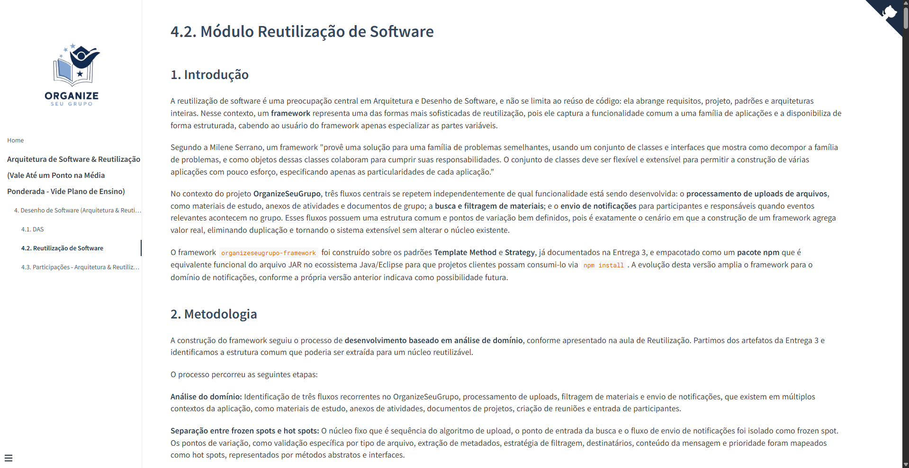
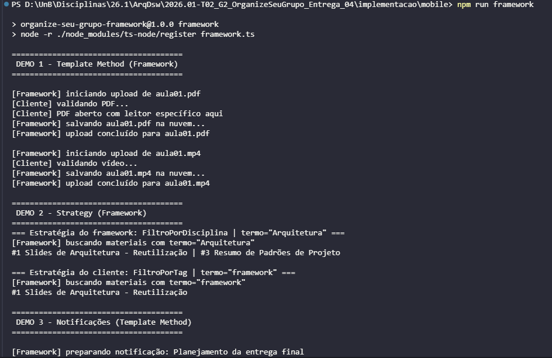
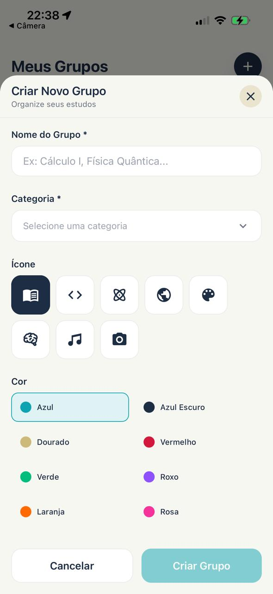

# OrganizeSeuGrupo - Entrega 04

**Código da Disciplina**: FGA0208<br>
**Número do Grupo**: 02<br>
**Entrega**: 04<br>

## Alunos
|Matrícula | Aluno |
| -- | -- |
| 232013944 | Camila Cavalcante |
| 232014807 | Luísa de Souza Ferreira |
| 231035731 | Mayara Marques Silva |

## Sobre 

Esta é a **Entrega 04** da disciplina *Arquitetura e Desenho de Software* (FGA0208), cujo tema é **Arquitetura & Reutilização de Software**. O Grupo 02 optou pelo foco **Reutilização de Software**, demonstrando o tema com **parte conceitual + código rodando**.

A entrega tem duas frentes complementares, que cobrem as duas faces da reutilização:

- **Framework próprio** (`organizeseugrupo-framework`) - construção de um framework Caixa Branca com os padrões **Template Method** e **Strategy**, evoluído para o domínio de **notificações**. Código didático em `implementacao/framework.ts`.
- **Estudo de caso em escala real** - o **módulo de grupos de estudos** (`implementacao/mobile/`) reutiliza frameworks consolidados (**Express** no back e **React Native + Expo** no front) para entregar a funcionalidade "Meus Grupos", ocupando os *hot spots* deles sem reescrever seus *frozen spots*.

A documentação completa está no site do projeto:
- [4. Arquitetura & Reutilização de Software](/ArquiteturaReutilizacao/4.ArquiteturaReutilizacao.md)
- [4.2. Reutilização de Software](/ArquiteturaReutilizacao/4.2.ReutilizacaoDeSoftware.md) (foco principal, inclui o estudo de caso na Seção 9)
- [4.3. Participações](/ArquiteturaReutilizacao/4.3.ParticipacoesArqReutilizacao.md)

## Screenshots da Quarta Entrega

<p align="center">
  <br>
  <b>Figura 1 -</b> Documentação do Módulo de Reutilização de Software (4.2) publicada no GitPages/docsify.
</p>

<p align="center">
  <br>
  <b>Figura 2 -</b> Execução do framework didático (<code>npm run framework</code>): demos de Template Method, Strategy e Notificações.
</p>

<p align="center">
  <br>
  <b>Figura 3 -</b> Módulo de grupos no app (React Native + Expo): tela "Meus Grupos" com o modal "Criar Novo Grupo".
</p>

## Há algo a ser executado?

( **X** ) SIM

( ) NÃO

Se SIM, insira um manual (ou um script) para auxiliar ainda mais os interessados na execução.

**Framework didático (TypeScript):**
```bash
cd implementacao
npm install
npm run framework   # executa o demo e imprime no console
```

**Backend do módulo de grupos (Express):**
```bash
cd implementacao/mobile/backend
npm install
npm run dev         # sobe a API em http://localhost:3000
# GET  http://localhost:3000/grupos
# POST http://localhost:3000/grupos  body: { "nome": "...", "categoria": "..." }
```

**Frontend do módulo de grupos (React Native + Expo):**
```bash
cd implementacao/mobile/frontend
npm install
npm start           # abre o Expo
# A URL base do backend fica em src/config.ts (emulador Android: 10.0.2.2; device físico: IP da máquina)
```

**Vídeo de Execução**
<center>

<iframe width="560" height="315" src="https://www.youtube.com/embed/9EvfG-UFrAQ?si=vFVi8_WJrZCMjUJ8" title="YouTube video player" frameborder="0" allow="accelerometer; autoplay; clipboard-write; encrypted-media; gyroscope; picture-in-picture; web-share" referrerpolicy="strict-origin-when-cross-origin" allowfullscreen></iframe>

</center>

<p align="center"><b>Vídeo 1 -</b> Apresentação app web e mobile.</p>

<p align="center"><b>Fonte:</b> Mayara Marques</p>

## Histórico de Versões

| Versão | Data       | Descrição                                                      | Autor                   | Revisor                 |
| :----: | ---------- | -------------------------------------------------------------- | ----------------------- | ----------------------- |
| `1.0`  | 22/06/2026 | Criação do documento| [Mayara Marques](https://github.com/maymarquee) | [Luísa de Souza](https://github.com/luisa12ll) |
| `1.1`  | 26/06/2026 | Adição de vídeo de execução | [Mayara Marques](https://github.com/maymarquee) | [Camila Silva](https://github.com/CamilaSilvaC) |